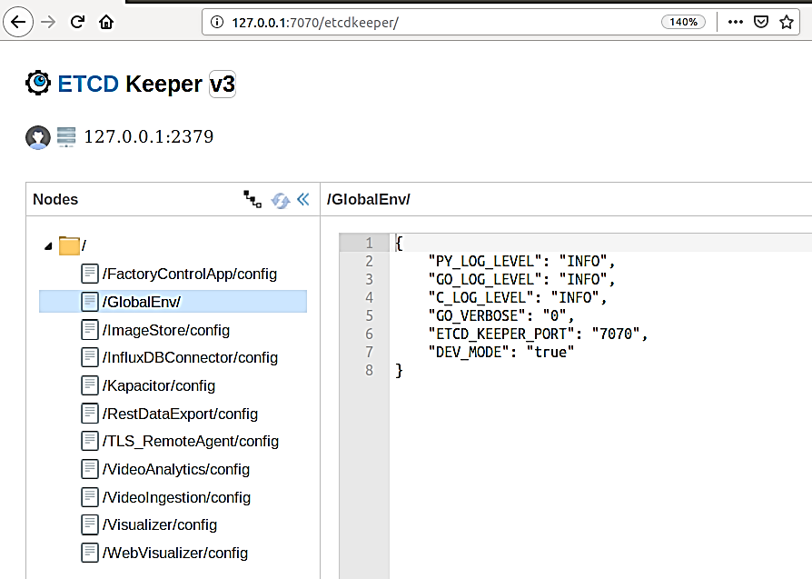

# ETCD UI Service

Once EII Configuration Management (ia_etcd) service is successfully up, user can access the ETCD web UI through the steps below. This allows user to make configuration changes for respective EII container services.

* Open your browser and enter the address: https://< host ip >:7071/etcdkeeper/ (when EII is running in secure mode). In this case, CA cert has to be imported in the browser. For insecure mode i.e. DEV mode, it can be accessed at http://< host ip >:7070/etcdkeeper/.
* Click on the version of the title to select the version of ETCD. The default is V3. Reopening will remember your choice.
* Right click on the tree node to add or delete.
* For secure mode, authentication is required. User name and password needs to be entered in the dialogue box.
* Username is 'root' and default password is located at ETCDROOT_PASSWORD key under environment section in [docker-compose.yml](https://github.com/open-edge-insights/eii-configmgr-agent/blob/master/docker-compose.yml).
* This service can accessed from a remote system at address: <https://$(HOST_IP):7071> (when EII is running in secure mode). In this case, CA cert has to be imported in the browser. For insecure mode i.e. DEV mode, it can be accessed at <http://$(HOST_IP):7071>



---
**NOTE**:

1. If ETCDROOT_PASSWORD is changed, there must be consolidated docker-compose.yml generated using builder script and EII must to be provisioned again.
   Please follow below command:

    ```sh
    cd [WORKDIR]/IEdgeInsights/build
    python3 builder.py -f usecases/<usecase.ml>
    docker-compose up -d ia_configmgr_agent
    ```

2. Only VideoIngestion and VideoAnalytics based services will have watch for any changes. Any changes done to those
   keys will be reflected at runtime in EII.
3. For changes done to any other keys, EII stack needs to be restarted for it to take effect. Please execute below
   command in working directory build/ to restart EII.

    ```sh
    cd [WORKDIR]/IEdgeInsights/build
    docker-compose down
    docker-compose up -d
    ```

---
